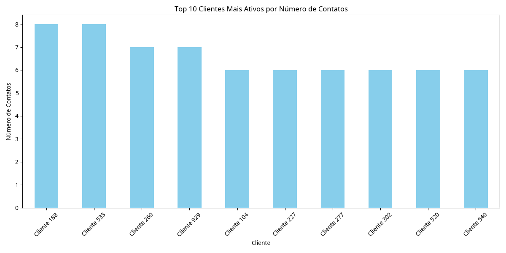
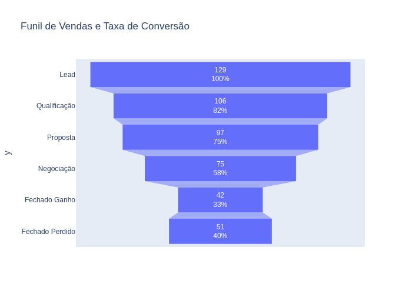
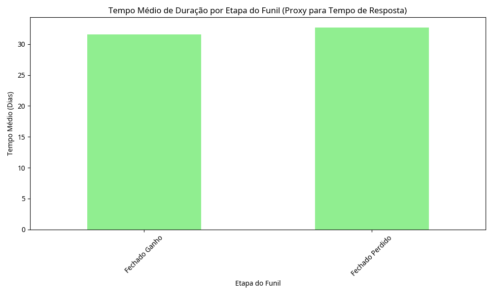

# Projeto ETL e Análise Automatizada de Dados de CRM

## Visão Geral

Este projeto demonstra a criação de um pipeline ETL (Extração, Transformação, Carga) automatizado para análise de dados de CRM, utilizando ferramentas gratuitas. O objetivo é fornecer insights visuais sobre o comportamento do cliente, funil de vendas e desempenho do atendimento, democratizando o acesso à inteligência de dados para pequenos negócios e freelancers.

## Ferramentas e Tecnologias

*   **Python**: Para scripts ETL, análises e automação.
    *   `pandas`: Manipulação e análise de dados.
    *   `matplotlib`/`plotly`: Visualização de dados.
    *   `schedule`: Agendamento de tarefas.
*   **Google Sheets / CSV**: Como fonte de dados do CRM.
*   **Jupyter Notebook / Google Colab**: Para desenvolvimento e experimentação. 
*   **Git / GitHub**: Para controle de versão e publicação do projeto.

## Estrutura do Projeto

```
crm_etl_project/
├── data/                 # Dados brutos e transformados
├── scripts/              # Scripts Python para ETL, análise e automação
├── reports/              # Relatórios gerados e visualizações
├── docs/                 # Documentação adicional e imagens para o README
└── README.md             # Este arquivo
```

## Como Usar

(Instruções detalhadas serão adicionadas aqui)

## Análises e Visualizações

(Exemplos de análises e gráficos serão adicionados aqui)

## Automação

(Detalhes sobre o agendamento serão adicionados aqui)

## Contribuição

(Informações sobre como contribuir serão adicionadas aqui)

## Licença

Este projeto está licenciado sob a licença MIT. Veja o arquivo `LICENSE` para mais detalhes.


## Como Usar

Para configurar e executar este projeto, siga os passos abaixo:

1.  **Clone o Repositório:**
    ```bash
    git clone https://github.com/SEU_USUARIO/crm_etl_project.git
    cd crm_etl_project
    ```

2.  **Crie um Ambiente Virtual (Opcional, mas Recomendado):**
    ```bash
    python3 -m venv venv
    source venv/bin/activate  # No Windows: .\venv\Scripts\activate
    ```

3.  **Instale as Dependências:**
    ```bash
    pip install pandas matplotlib plotly schedule kaleido
    ```

4.  **Gere os Dados Fictícios:**
    Execute o script `generate_data.py` para criar os arquivos CSV de exemplo na pasta `data/`.
    ```bash
    python scripts/generate_data.py
    ```

5.  **Execute o Pipeline ETL:**
    Execute o script `etl_pipeline.py` para processar os dados e salvá-los em `data/processed/`.
    ```bash
    python scripts/etl_pipeline.py
    ```

6.  **Gere as Análises e Visualizações:**
    Execute o script `analysis.py` para gerar os gráficos e salvá-los em `reports/`.
    ```bash
    python scripts/analysis.py
    ```

7.  **Execute o Agendador de Relatórios (Opcional):**
    Para automatizar a execução diária do pipeline e das análises, execute o script `automate_report.py`.
    ```bash
    python scripts/automate_report.py
    ```
    Este script rodará em segundo plano e executará as tarefas agendadas. Pressione `Ctrl+C` para pará-lo.


## Análises e Visualizações

Este projeto gera três análises principais, com suas respectivas visualizações:

### 1. Top 10 Clientes Mais Ativos por Número de Contatos

Esta análise identifica os clientes que mais interagiram com o CRM, com base no número de contatos registrados. Isso pode indicar clientes de alto engajamento ou que necessitam de mais atenção.



### 2. Funil de Vendas e Taxa de Conversão

Visualiza o funil de vendas, mostrando a quantidade de oportunidades em cada estágio (Lead, Qualificação, Proposta, Negociação, Fechado Ganho, Fechado Perdido) e as taxas de conversão entre eles. Ajuda a identificar gargalos no processo de vendas.



### 3. Tempo Médio de Duração por Etapa do Funil (Proxy para Tempo de Resposta)

Embora não tenhamos dados diretos de tempo de resposta, esta análise utiliza a duração média que uma oportunidade permanece em cada etapa do funil como um proxy. Isso pode indicar a eficiência do processo de atendimento e vendas em cada fase.




## Automação

O projeto inclui um script `automate_report.py` que utiliza a biblioteca `schedule` do Python para agendar a execução periódica do pipeline ETL e das análises. Por padrão, ele está configurado para rodar a cada 1 minuto para fins de demonstração, mas pode ser facilmente ajustado para intervalos maiores (ex: diário, semanal).

Para agendar a execução:

```bash
python scripts/automate_report.py
```

Este script manterá o processo ativo, executando as tarefas agendadas em segundo plano. Para pará-lo, basta pressionar `Ctrl+C` no terminal.


